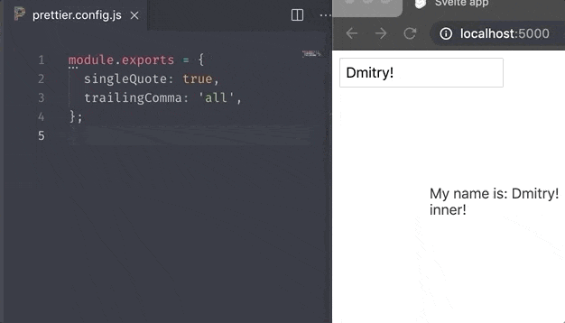

# Svelte inspector

Development helper for inspecting and opening [`svelte`](https://github.com/sveltejs/svelte) components in your editor.

<p align="center">
  
</p>

## Installation

`npm i --save-dev svelte-inspector`

## Usage

1. Import `svelte-inspector` package and call the function at the top of your bundle configuration file (ex. rollup, webpack, parcel, etc...):

```javascript
import startInspector from 'svelte-inspector';
startInspector(/*config*/);
```

or

```javascript
const startInspector = require('svelte-inspector');
startInspector(/*config*/);
```

2. Add this code in the index file of your client code: (**Don't forget to cut this code in the final production bundle**)

```javascript
const script = document.createElement('script');
script.src = 'http://0.0.0.0:5001/start';
document.body.appendChild(script);
```

**or** this code in the bottom of **_body_** tag in index.html

```html
<script type="application/javascript" src="http://0.0.0.0:5001/start"></script>
```

3. Open your web app and press 'O' (configurable) for toggling the inspecting mode.

4. Move cursor to the element and press 'A' to open element's component in the editor.

## Configuration

```javascript
{
  // Code for the key that activates inspecting mode
  // default 79 - means for 'O'
  activateKeyCode: 79;
  // Code for the key that opens file in editor
  // default 65 - means for 'A'
  openFileKeyCode: 65;
  // Default editor to open inpspected components
  // default 'code' - means for 'VS Code'
  // Allowed values: 'sublime', 'atom', 'code', 'webstorm', 'phpstorm', 'idea14ce', 'vim', 'emacs', 'visualstudio'
  editor: 'code';
  // Inspector's color
  color: '#009688';
}
```
